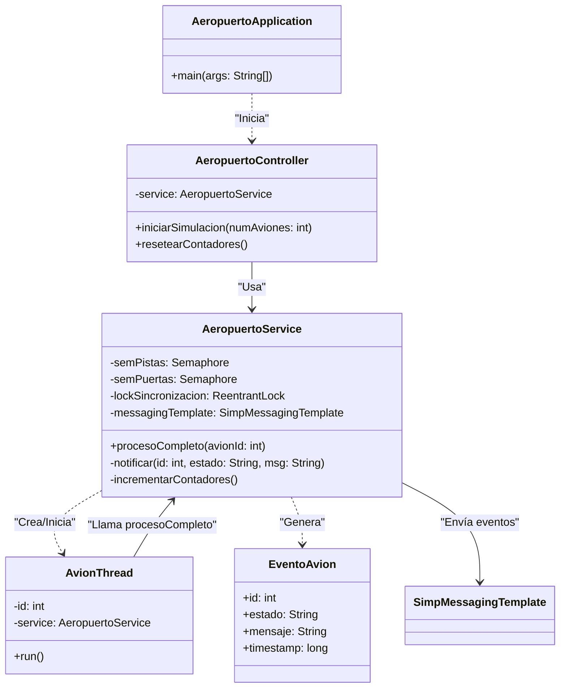
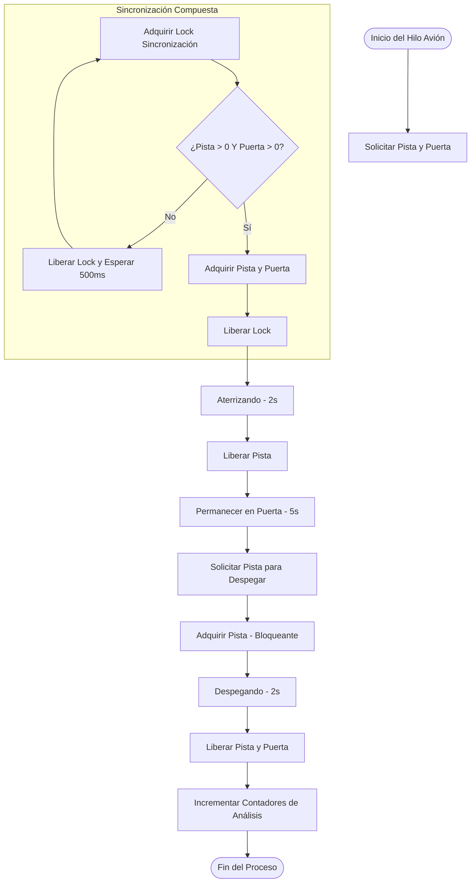
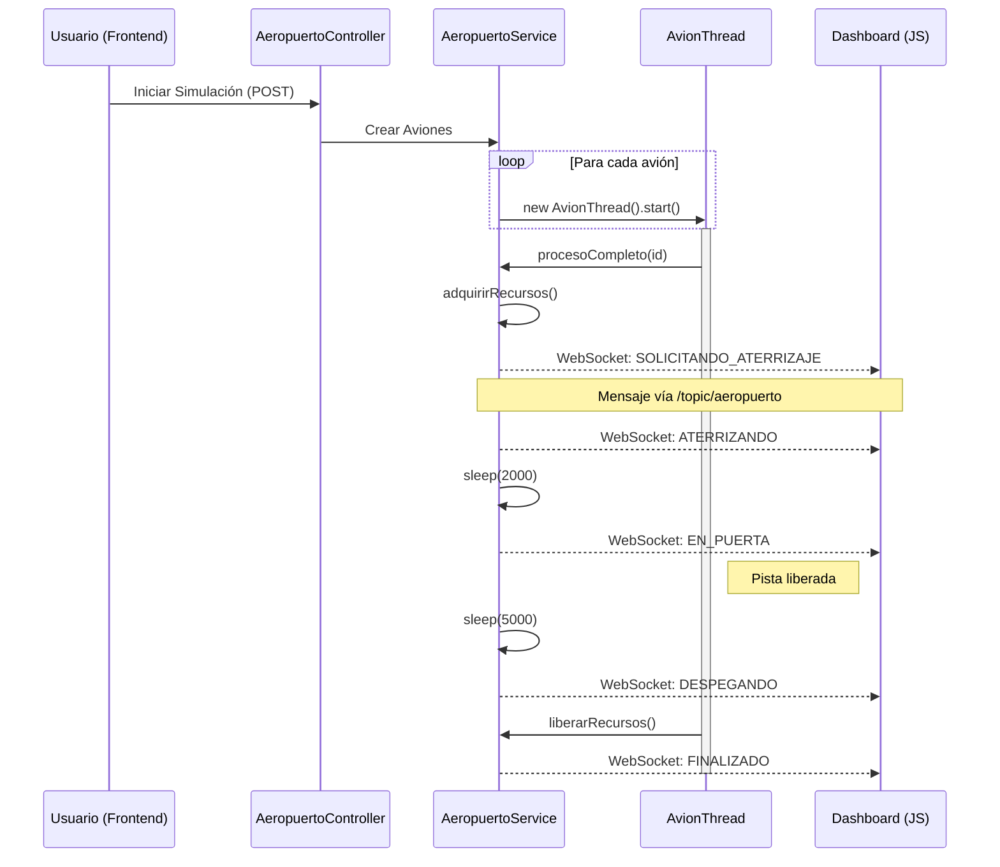

# AeroSim — Simulación de Aeropuerto

Este proyecto es una simulación avanzada de la operación de un aeropuerto enfocada en conceptos de **Sistemas Operativos** como concurrencia, semáforos, exclusión mutua (Mutex) y prevención de condiciones de carrera.

El sistema cuenta con un **Backend en Java** que gestiona la lógica de hilos y sincronización, y un **Frontend Web** dinámico que visualiza los eventos en tiempo real mediante WebSockets.

---

## 🚀 Instrucciones de Despliegue

Sigue estos pasos para poner en funcionamiento el proyecto en tu máquina local.

### 📋 Requisitos Previos

Asegúrate de tener instalado lo siguiente:
- **Java JDK 21** (o superior).
- **Maven** (opcional, ya que el proyecto incluye el envoltorio `mvnw`).
- Un navegador web moderno (Chrome, Edge, Firefox).

---

### 🖥️ 1. Iniciar el Backend (Java)

El servidor central gestiona los hilos de los aviones y la sincronización de recursos (pistas y puertas).

1. Abre una terminal en la carpeta raíz del proyecto.
2. Navega a la carpeta del backend:
   ```powershell
   cd backend
   ```
3. Ejecuta el servidor usando el comando de Maven:
   ```powershell
   ./mvnw spring-boot:run
   ```
4. El backend estará listo cuando veas el mensaje `Started SimulacionAeropuertoApplication` en la terminal. Por defecto, corre en el puerto **8090**.

---

### 🌐 2. Iniciar el Frontend (Web)

La interfaz es estática, por lo que no requiere instalación de dependencias de Node.js.

1. Navega a la carpeta `frontend/`.
2. Tienes dos opciones para abrirlo:
   - **Opción A (Fácil):** Haz doble clic en el archivo `index.html` para abrirlo directamente en tu navegador.
   - **Opción B (Recomendada):** Usa un servidor local sencillo (como la extensión "Live Server" de VS Code o `python -m http.server`) para evitar problemas de permisos de archivos locales.

---

## 🛠️ Cómo Funciona la Simulación

Una vez que ambos componentes estén activos:

1. **Conexión:** Verifica que el indicador en la esquina superior derecha diga **"CONECTADO — :8090"**.
2. **Configuración:**
   - Usa el slider para elegir la cantidad de **aviones** (1 a 20).
   - Selecciona el **Modo de Simulación**:
     - **Mutex + concurrencia:** El backend utiliza semáforos y bloques sincronizados para asegurar que no haya colisiones ni estados inconsistentes.
     - **Sólo semáforos:** Una simulación directa del uso de recursos.
3. **Control:** Haz clic en **▶ INICIAR** para disparar los hilos en el backend. Verás cómo los aviones aparecen en la cola, aterrizan en la pista y se dirigen a las puertas de embarque.

---

## 🏗️ Estructura del Proyecto

```text
├── backend/
│   ├── src/main/java/      # Lógica de Semáforos y Hilos (Java)
│   ├── pom.xml             # Dependencias de Spring Boot
│   └── mvnw                # Ejecutable de Maven
├── frontend/
│   ├── index.html          # Interfaz y Dashboard
│   └── styles.css          # Estilos premium y animaciones
└── README.md               # Este archivo
```
# Diseño del Sistema - Simulación de Aeropuerto Concurrente

Este documento describe la arquitectura, el diseño de clases y los flujos de procesos del sistema de simulación de aeropuerto.

## 1. Arquitectura de Alto Nivel

El sistema sigue una arquitectura de **Microservicios Simplificada** con comunicación en tiempo real:

-   **Backend (Java + Spring Boot)**: Gestiona la lógica de concurrencia, el ciclo de vida de los hilos y la sincronización de recursos.
-   **Frontend (HTML + JS)**: Panel de control visual que recibe actualizaciones de estado mediante WebSockets.
-   **Comunicación (WebSocket/STOMP)**: Canal bidireccional para enviar eventos desde el servidor al cliente sin necesidad de polling.

---

## 2. Diagrama de Clases (UML)

Este diagrama muestra la relación entre los componentes principales del backend.



---

## 3. Diagrama de Flujo (Lógica del Avión)

Describe el ciclo de vida de un avión y cómo interactúa con los recursos compartidos (Pistas y Puertas).



---

## 4. Diagrama de Secuencia (Comunicación Tiempo Real)

Muestra la interacción entre el usuario, el backend y el dashboard visual.



---

## 5. Análisis de Concurrencia y Sincronización

### Recursos Limitados
-   **Pistas (2)**: Controladas por `Semaphore semPistas`. Es un recurso crítico tanto para aterrizaje como para despegue.
-   **Puertas de Embarque (4)**: Controladas por `Semaphore semPuertas`. El avión la mantiene ocupada durante toda su estancia en el aeropuerto.

### Estrategias de Sincronización
1.  **Sincronización Compuesta**: Para evitar que un avión bloquee una pista si no hay puertas disponibles (lo cual causaría un posible deadlock o espera innecesaria de la pista), el sistema utiliza un `ReentrantLock` para verificar la disponibilidad de **ambos** recursos de forma atómica antes de adquirirlos.
2.  **Prevención de Deadlocks**: Al liberar la pista inmediatamente después del aterrizaje, se permite que otros aviones despeguen mientras el primero desembarca en la puerta.
3.  **Condiciones de Carrera (Análisis)**: El sistema incluye un `contadorInseguro` y un `contadorSeguro` (`ReentrantLock`) para demostrar visualmente en el dashboard cómo la falta de sincronización en variables compartidas produce resultados incorrectos bajo carga.


